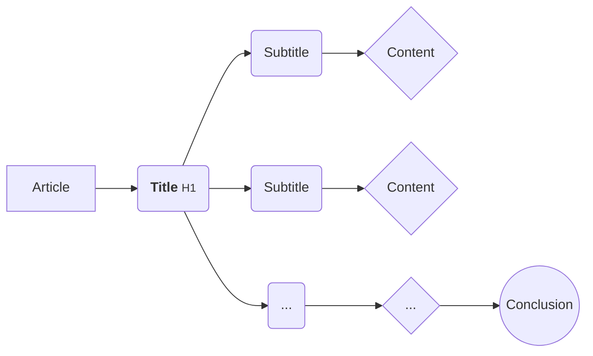
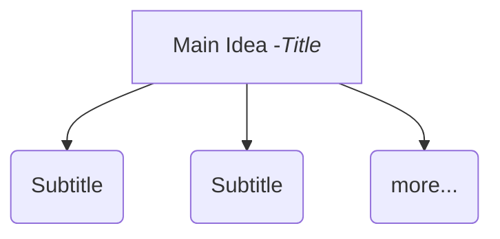

In this *super article* you will learn certain tricks with which you will be able to increase the number of visits to your website writing better content.

A well-made article can have the following advantages:

* **Attract users and search engines to your webpage** when many users click on your article that makes it look to search engines that the content may be good and shows it more.
* **If people like your article, they'll want more** a good title can also help a person start remembering your website (and your brand) and visit it more often.
* **Your articles can also be viralized** It is true that you would have to make certain modifications but this is very simple and I'll show you now.

## Make Better Titles.

A normal problem when you are creating an article are the titles, you have to think that these will be the first thing that your users see, either on Google, on the platform on which you upload it or on the page of the article.

### Why are Titles Important?

Titles usually serve to attract people to your content but search engines (Google, Bing, DuckDuckGo, Yahoo, etc.) use them as one of the factors to rank your content in their large databases.

Your titles will appear in three main places:

1. Search engine result pages
2. Browser Tabs
3. Social Networks

### Learn Now Clickbait.

The Clickbait is a strategy to increase the CTR (Click Through Rate, number of clicks you get a link regarding your number of impressions).

#### How does the Clickbait work?

Clickbait takes advantage of the innate curiosity of humans.

Here you can see a clear example of clickbait:

In the clickbait there are normally **two common parts, the news and the event that happened after**.

In this case the news is about *man **tries** to hug a wild lion* and the event occurred after is not known, it provokes intrigue and to finish off says *you won't believe what happens next!*.

#### 13 Clickbait templates.

Here are 13 templates that will work for you when writing your clickbait article.

1. **The [number] secrets [for/to] [something desirable]**
2. **How [something desirable/accomplishment/topic]**. Example: *How to sell fear*.
3. **[Number] mistakes that most people make when [action]**
4. **How [desired result] in [space of time]**. Example: *How did we earn 2 million dollars in 1 year?*
5. **The Definitive [guide/list] [to/of] [topic/something desirable]**
6. **[Keyword]: [Phase that defines it that is incomplete]**. Example: *Presumption: Vanity that shows a person who…*
7. **[Imperative order]**. You can use words like: *NO, Stop, Ceases, etc*. Example: *Stop Believing in Nonsense Like Communism. They DO NOT work.*.
8. **We have analyzed [a large number of something] and this is what we have discovered.**
9. **[Number] proven techniques to [achieve a result]**
10. **The [number] lessons I've learned [doing something]**.
11. **[Someone] [has done something] [and/.] [look what happened/this happened/…]**. This is the most common clickbait.
12. **[Do something like a celebrity]**. Example: *Learn to grow a mustache like Hitler*.
13. **Tutorial to [get a positive result]**. Example: *The easiest tutorial to get followers in Instagram*.

---

### Use Numbers in Titles.

Titles that use numbers (usually at the beginning of the sentence) tend to have 15% CTR compared to other methods. This is fantastic!

All this data comes from a Moz study that you can read by clicking [here](https://moz.com/blog/5-data-insights-into-the-headlines-readers-click).

Here you can see the conversion using numbers compared to other methods:

This study, apart from generally attracting anyone, can be observed that it attracts a little more women than men:

You can use this method in many ways but here is a simple guide:

* **Use them to create lists at the beginning of the title**. It is best to write the number at the beginning of the article (if it is possible). Examples:
  * *17 Ways to Win a Fight*.
  * *13 Tips for Creating a Website*.
* **If the list is bigger, it's much better**. Lists with more content attract more users. Examples:
  * *23 Methods for Learning Architecture*.
  * *31 Things you don't know about Paris*.
* **Use odd numbers** it seems strange but for some reason it attracts more attention, for example: 15, this number gives the sensation of being a list of 14 + 1 elements.

### Make your Titles Clear, Simple and Direct.

Your titles have to stand out in their simplicity, try to express the key concept of the article in the smallest (and best) number of words.

Google usually displays titles without dots (*…*) when they are less than 60 characters \*\*\*. Try not to go over the limit.

There are different ways to write a title but these are the most common:

* **Normal** *Ways to Create Eye-catching Headlines*
* **With Numbers** *25 Ways to Create Eye-catching Headlines*
* **Speaking to the reader** *Ways to Make Your Headlines Eye-catching*
* **Question** *What Ways Are There to Create Eye-catching Headlines?*
* **Indirect question with 'How'** *How to Create Eye-catching Headlines*

Normally, the one that can be most useful to you is the method that uses numbers (2nd).

### Use 'NO' and Superlative Adjectives

This is a good technique, doing tests, I have given 37% more clicks compared to other articles of the same type.

Do not abuse this technique, only use it when necessary. Try to use on average only one superlative adjective per title.

Here you can see a table of titles and how they are changed by adding or decreasing the amount of superlative adjectives.

| Example Sentence       | N. of Superlative  Adjectives |
| --- | --- |
| 27 Ways to Train a Dog       | 0 |
| 27 Best Ways to Train a Dog       | 1 |
| 27 Best Ways to Train a Dog Forever       | 2 |
| 27 Best Ways to Train a Dog Perfectly And Forever       | 3 |
| The 27 Best and Smartest Ways to Train a Dog Perfectly and Forever       | 4 |

### Uppercase and/versus Lowercase in your Title

Several studies agree that to put the first letter of each word in capital letters ( except in determinants, prepositions, etc.), is better than to write everything in capital letters or in small letters. Examples:

1. [☑] 25 Things You Shouldn't Do in Spain.
2. [☒] 25 THINGS YOU SHOULDN'T DO IN SPAIN.
3. [☒] 25 things you shouldn't do in spain.

The first method is best for most cases.The second method can also be applied to certain places, such as YouTube.The third method does not attract much, I advise you not to use it for titles.

## Content of the Article.

Content is THE FUNDAMENTAL PART of the article, the article has no value without content, so let's learn how to make good content.

### Article Structure

### Legibility of the Article.

To be able to easily understand an article is vital, here enters the typography, the size of this and the space between lines and paragraphs.

#### Typographies suitable for your web.<!-- Intenta usar para el texto tipografías de *Palo Seco*, intenta NO usar *Rotuladas*, *Decorativas* y/o *Romanas* (estas pueden ser buenas para títulos).-->

A great repository of fonts is [Google Fonts](https://fonts.google.com). Although there are others, this is the best free.

I recommend typographies such as *[Open Sans](https://fonts.google.com/specimen/Open+Sans)*, *[Lato](https://fonts.google.com/specimen/Lato)*, *[Roboto](https://fonts.google.com/specimen/Roboto)* or any typography of type **[Sans Serif](https://fonts.google.com/?category=Sans+Serif)**.

For the titles you can use the same typography as the text but if you want you can see the [Serif](https://fonts.google.com/?category=Serif) typographies.

#### Font size.

Normally the text should have a **size between 17px to 25px** and try to make the **text smaller in the mobile** version of your website.

Try to differentiate in size and thickness the titles (and a little opacity), for example:

* *Title* bold and no opacity.
* *Text* thickness 400 and some opacity.

#### Line spacing.

The spacing between lines is important, this is a **<abbr title="Cascading Style Sheet">CSS</abbr> property**, this is called `line-height: 1.5;`, normally a good number to put there is 1.5, is enough to be able to read it well.

### Subtitles, images, videos, lists, bold and italics.

Knowing how to use all these components is very important, and here is a detailed guide.

#### Subtitles.

Subtitles are used to divide the main concept into several *sub*concepts. For example:

#### Images and Videos (YouTube).

The images are used to display content, try not to add too many photos to your article, they make the page load slower. You can add about 0 ~ 5 photos (in low quality) per article.

The videos are very easy to add, we search for the video on YouTube, click on the video, go to the share button and click it. Then you select insert, copy the code and paste it into the editor of your article.
<!--  ADD PHOTOS  -->

#### Lists (ul & ol).

There are two main types of lists, the disordered (`<ul>`) and the ordered (`<ol>`) lists.

Disordered lists are more common, simply dealing with dots with text, example:

* A
* B
* C

The ordered lists are numbered by a number instead of dots, for example:

1. A
2. B
3. C

#### Bold and Italics.

Many users who will read your article will not read it all, adding **bold** and *cursive* is important to make the text more readable and more *shortable*.

When you want to highlight a concept use **bold**. In order to know if you have done it well you can only use the bold in the article and if you understand it it means that you have done it well.

When you want to show a concept that is not known or you want to write what someone has said or you want to replace the quotation marks (*" "*, *' '*) you can use *cursive*.

You can also use (if your editor allows it) the ==marked text==. It's similar to bold but more eye-catching.

### Quantity of words for your articles.

Maybe your 500 word articles are enough or maybe you need 5000 word articles to tell what you need, this will depend on your subject, the closer you are to leisure the shorter they should be and the more formative they are the longer and more detailed they should be.

*How many words does my article have to have?* It's a good question, the answer: *ask your **Audience***.

#### Segment Visitors.

If they are scientific, technological, news or any topic that is not fun should have the **maximum of possible words** (unless it is unknown about the topic).

Try making **longer articles** without writing nonsense and **writing enough**.

#### Common Average of Words per Article.

Medium](https://medium.com) is a great *news portal*, they did a [research](https://medium.com/data-lab/the-optimal-post-is-7-minutes-74b9f41509b) and saw that the **most visited** and *loved* articles were those that lasted about **7 minutes**.

#### How many Minutes can my Articles be.

This can vary a lot, people don't like to spend an hour reading (unless your content is super good), so try not to make an article too long but don't leave anything unsaid (use as few words as possible).

#### Advantages of Long versus Short Content.

A [SerpIQ study](blog.serpiq.com/how-important-is-content-length-why-data-driven-seo-trumps-guru-opinions/) determines that content over 2000 words tends to be much better positioned on Google.

#### Utility according to Number of Words.

If your content has more words *logically* it will be better positioned in Google.

##### Learn About Long Tail Keywords.

Using the ***long tail*** method is important if your blog is starting or if you want more visitors, here you can see a graph of how it works:

It's much easier to get out first in the search for *buy a microwave oven and grill* than if you're looking for *oven* ( *logically* 😀).

##### Get More External Links.

The extensive articles give a feeling of contributing more than one that has a few words, Moz made a [study](https://moz.com/blog/what-kind-of-content-gets-links-in-2012) in which they observed that articles with more words had more links from other websites (social networks, forums, other articles, etc.).

##### Greater possibility of Viralization.

This is also related to the number of words and the sensation it gives us. Buzzsumo did an analysis with more than 100 million articles and found that the longer the article, the more likely it was to be shared on social networks.

<!-- Abbreviations -->